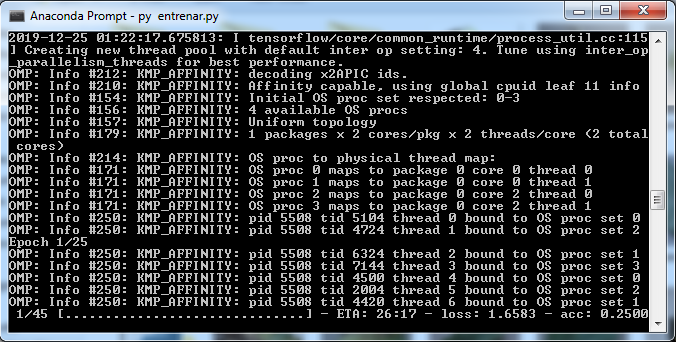
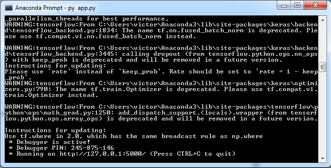
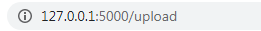
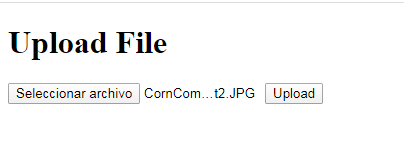
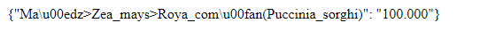

# Plantvillage-Alexnet-API

_Esta es una API REST que utiliza un modelo de red neuronal convolucional entrenado en base al dataset de plantvillage,
este modelo esta compuesto por una arquitectura de red neuronal convolucional llamada la AlexNet, con la cual se busca predecir enfermedades de plantas mediante imagenes._

### Pre-requisitos 📋
- [Anaconda](https://www.anaconda.com/)


_Tensorflow >1.9_

```
conda install -c conda-forge tensorflow
```
_Keras_

```
conda install -c conda-forge keras
```
### Entrenamiento
_Tener nuestro dataset de imagenes de Plantvillage en la carpeta del proyecto_
_Cambiar rutas de los archivos en el archivo entrenar.py_

_Abrir Anaconda Prompt, buscar el directorio donde esté el proyecto._
_Escribimos el siguiente comando_
```
python entrenar.py
```
_Empezará a entrenarse de la siguiente manera_



## Ejecutando la API ⚙️
_En caso que no sea la ruta especificada por defecto cambiar las ruta de los output del modelo y los pesos en el archivo predict.py_
_Abrir Anaconda Prompt, buscar el directorio donde esté el proyecto._
_Escribimos el siguiente comando_
```
python app.py
```
_Tendremos ejecutando nuestro servidor así_




_Escribimos esta ruta en el navegador_



 _Seleccionamos una imagen de prueba(debe estar en la carpeta del proyecto)_
 
 
 
 _Y nos dara como resultado el JSON con las predicciones_



## Wiki 📖

Puedes leer mas sobre el entrenamiento con el dataset plantvillage [Documentación](https://github.com/victorgbd/plantvillage-alexnet-api/blob/master/documentacion.pdf)

## Licencia 📄

Este proyecto está bajo la Licencia (MIT) - mira el archivo [LICENSE](LICENSE) para detalles


