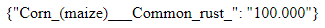

# Plantvillage-Alexnet-API

_Este es una API REST que utiliza un modelo de red neuronal convolucional entrenado en base al dataset de plantvillage,
este modelo esta compuesto por una arquitectura de red neuronal convolucional llamada la AlexNet, con la cual se busca predecir enfermedades de plantas mediante imagenes._

## Comenzando 🚀

_Estas instrucciones te permitirán obtener una copia del proyecto en funcionamiento en tu máquina local para propósitos de desarrollo y pruebas._

Mira **Deployment** para conocer como desplegar el proyecto.


### Pre-requisitos 📋
- [Anaconda](https://www.anaconda.com/)


_Tensorflow >1.9_

```
conda install -c conda-forge tensorflow
```
_Keras_

```
conda install -c conda-forge keras
```
## Ejecutando las pruebas ⚙️

_Abrir Anaconda Prompt, buscar el directorio donde esté el proyecto._
_Escribimos el siguiente comando_
```
python app.py
```
_tendremos ejecutando nuestro servidor así_


_Escribimos esta ruta en el navegador_


 _Seleccionamos una imagen de pruena(debe estar en la carpeta del proyecto)_
 
 
 
 _Y nos dara como resultado el JSON con las predicciones_



## Wiki 📖

Puedes leer mas sobre el entrenamiento con el dataset plantvillage [Documentacion](https://github.com/victorgbd/plantvillage-alexnet-api/blob/master/documentacion.pdf)

## Licencia 📄

Este proyecto está bajo la Licencia (MIT) - mira el archivo [LICENSE.md](LICENSE.md) para detalles


